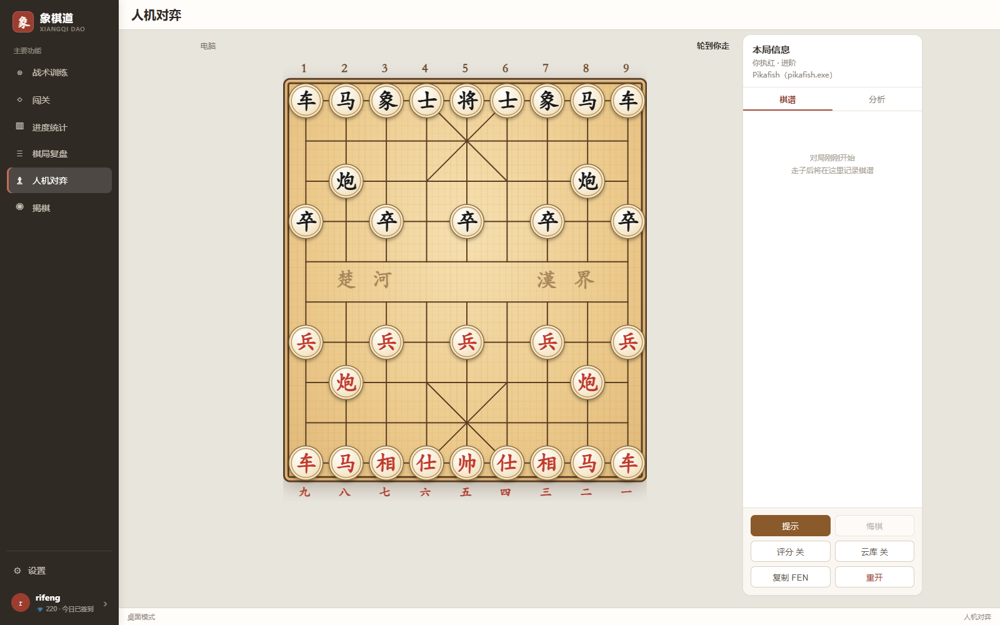

# 象棋道 Xiangqidao

**把每盘棋里反复出现的漏算，变成下一次训练的重点。**

象棋道是一套面向象棋爱好者的训练与复盘工具。它把战术题、间隔复习、人机对弈、棋局分析和成长统计串成一条学习路径，让你每次打开应用都知道今天该练什么，而不是在题库里漫无目的地刷题。

目前可通过 Web 浏览器和 Windows PC 客户端使用；标准象棋功能最完整，同时提供揭棋对弈。项目也为后续 Android 客户端保留了共用前端与 Tauri 基础。



## 你可以用它做什么

- **完成今日训练**：优先复习即将遗忘的题，再学习适量新题。
- **针对弱点专项练习**：按杀法、开局、中局、残局或具体类目选题。
- **循序渐进闯关**：用关卡和星级建立清晰的学习进度。
- **与电脑下完整一局**：选择先后手和难度，支持提示、评估、悔棋与棋谱保存。
- **复盘自己的失误**：逐步查看局面评价，把实战漏着转成个人练习题。
- **查看长期变化**：跟踪首答正确率、ELO、段位、连续训练、薄弱杀法和复习日程。
- **获得教练建议**：即使不配置大模型，也能根据训练与对局数据生成学习计划；配置兼容的 LLM 服务后可获得更自然的棋理讲解和整局报告。
- **体验揭棋**：标准象棋与揭棋使用相互独立的规则和引擎配置。

## 它如何帮助你进步

象棋道关注的不是“今天做了多少题”，而是“同类错误是否越来越少”。一次完整的使用闭环是：

```text
今日任务 → 战术训练 → 间隔复习 → 人机实战 → 棋局复盘 → 弱点专项
```

训练题会根据你的作答表现安排下次复习时间；新题难度会参考近期首答正确率；实战中的关键漏着还可以进入个人题库。最终你看到的不只是一串完成数量，而是哪些能力在变好、哪些问题仍值得练。

## 第一次使用

启动后可以直接以游客身份体验。推荐按下面的顺序开始：

1. 打开“今日”，查看当天的新题和到期复习。
2. 在“训练”完成一组题；答错时可逐级获取提示。
3. 到“成长报告”查看正确率、评分和薄弱类目。
4. 在“对弈”下一盘棋，结束后进入“我的棋局”复盘。
5. 注册账号，保存独立的训练进度、棋谱、积分和教练计划。

登录不是体验基础训练的前提。AI 能力、用户专属数据和部分权益需要登录；是否可用由服务端配置决定。

## 本地运行

### 需要准备

- Python 3.10 或更高版本
- [uv](https://docs.astral.sh/uv/)（后端依赖与运行）
- Node.js 18 或更高版本及 npm

外部 UCI 引擎和 LLM 服务都是可选项。没有它们也能启动、训练和对弈。

### 1. 启动后端

```bash
cd backend
uv sync
uv run python -m app
```

后端默认运行在 `http://127.0.0.1:8000`。开发环境可访问 `http://127.0.0.1:8000/docs` 查看 API。

> 数据库迁移在应用启动时自动执行；公共题库为空时也会自动导入 [`backend/seeds/`](backend/seeds/) 下的种子题库（见[题库](#题库)），无需手动执行导入脚本。

### 2. 启动 Web 前端

另开一个终端：

```bash
cd frontend
npm install
npm run dev
```

浏览器打开 `http://localhost:5173`。开发服务器已将 `/api` 代理到本地后端。

### 3. 启动 Windows PC 客户端（可选）

安装 [Tauri 2 所需环境](https://v2.tauri.app/start/prerequisites/) 后运行：

```bash
cd frontend
npm install
npm run tauri dev
```

生成安装包：

```bash
cd frontend
npm run tauri build
```

产物位于 `src-tauri/target/release/bundle/`。PC 客户端仍需连接正在运行的后端服务；本地开发默认连接 `http://localhost:8000/api`。

## 可选：启用更强的棋力与 AI 讲解

### 用户提供的 UCI 引擎

象棋道不包含、代下载或分发第三方引擎和评估权重。用户可根据平台前往上游项目页面自行下载；引擎程序与权重可能采用不同许可证，商业使用前请分别确认。

PC 客户端可在“本机设置”中分别选择标准象棋和揭棋原生 UCI 引擎。自托管管理员可在“管理后台 → 系统设置”填写服务器上自行放置的引擎绝对路径。修改后立即生效，无需重启服务。未配置外部引擎时标准象棋使用内置搜索降级。

完整说明、推荐来源与目录设计见 [`docs/engines/`](docs/engines/README.md)。

### 浏览器本地引擎

Web 和 Android 用户可在设置页导入符合[引擎包规范](docs/engines/package-spec.md)的 WASM UCI 引擎目录。文件保存在浏览器或应用的本地存储中，不上传服务器，也不会进入项目构建产物。未导入或加载失败时自动降级到服务端能力。

### 通用 LLM AI 教练

管理员可在“管理后台 → AI 复盘设置”中选择 OpenAI Chat Completions、OpenAI Responses 或 Anthropic Messages 格式，并填写 Base URL、模型与密钥，即可启用个性化训练建议、逐步失误讲解、整局复盘报告和训练题讲解。DeepSeek 等兼容服务直接按其支持的通用格式接入。

密钥只保存在后端，不会打包进 Web 或 PC 客户端。未配置时，基于统计规则的画像和学习建议仍然可用。

## 题库

题库数据与代码分离，存放在 [`backend/seeds/`](backend/seeds/)：

- `seed_puzzles.json`：小型种子题库。
- `generated_puzzles.json`：内置生成器产出的杀法题。
- `wukong_puzzles.audited.json`：经过合法性、终局、多解与重复局面审计的较大题库。

应用启动时若公共题库为空，会自动导入 `seeds/` 目录下全部 JSON（目录可用 `SEEDS_DIR` 覆盖）；已有题库则跳过，因此扩容或更新题库需手动导入：

```bash
uv run python -m app.modules.puzzles.importer.load seeds/wukong_puzzles.audited.json
```

也可以生成新的一步杀题，产出直接放进种子目录：

```bash
uv run python -m app.modules.puzzles.importer.generate --count 100 --seed 1234 --out seeds/more.json
uv run python -m app.modules.puzzles.importer.load seeds/more.json
```

自有题库需转换为项目 JSON 格式，着法统一使用 UCI 坐标制，例如 `h2e2`。设置 `XIANGQI_ENGINE` 后可用 `--verify` 调用用户引擎校验，或先运行审计工具（默认读取 `backend/wukong_puzzles.json`，产出写入 `seeds/`）：

```bash
uv run python -m app.modules.puzzles.importer.load path/to/puzzles.json --verify
uv run python -m app.modules.puzzles.importer.audit_puzzles
```

格式示例可参考 [`backend/seeds/seed_puzzles.json`](backend/seeds/seed_puzzles.json)，审计说明见 [`backend/seeds/puzzle_audit_report.md`](backend/seeds/puzzle_audit_report.md)。

## 数据与账号

- 游客可以直接训练，数据归入当前访客身份。
- 注册后，训练记录、统计、棋谱和个人题目按用户隔离。
- 未指定 `ADMIN_USERNAME` 时，第一个注册用户会成为管理员。
- 管理员可以管理用户、题库、会员权益、AI 配置和服务端引擎。
- 默认使用 SQLite，数据库连接可通过 `DATABASE_URL` 替换。

如果要公开部署，请务必先注册并确认管理员账号，再对外开放服务。

## 常用配置

后端配置可写入 `backend/.env` 文件，启动时自动加载：复制 [`backend/.env.example`](backend/.env.example) 为 `backend/.env`，按需取消注释即可，无需重启脚本之外的操作。同名环境变量优先级高于 `.env`，线上部署（Docker、systemd 等）仍可直接用环境变量覆盖；`.env` 含密钥，已被 `.gitignore` 排除。

| 环境变量 | 用途 | 默认值 |
| --- | --- | --- |
| `HOST` / `PORT` | 后端监听地址与端口 | `127.0.0.1` / `8000` |
| `DATABASE_URL` | SQLAlchemy 数据库连接串 | `sqlite:///./data/puzzles.db` |
| `SEEDS_DIR` | 首次启动自动导入的题库种子目录 | `backend/seeds` |
| `APP_ENV` | 设为 `production` 时启用生产校验并关闭 API 文档 | 空 |
| `SECRET_KEY` | 登录 token 签名密钥；生产环境必须更换 | 本地开发占位值 |
| `CORS_ORIGINS` | 允许访问 API 的前端来源，逗号分隔 | 本地开发放开 |
| `ADMIN_USERNAME` | 指定管理员用户名；留空则首位注册者为管理员 | 空 |
| `XIANGQI_ENGINE` | 管理员自行放置的服务端标准象棋 UCI 引擎绝对路径 | 空 |
| `JIEQI_ENGINE` | 管理员自行放置的服务端揭棋 UCI 引擎绝对路径 | 空 |
| `LLM_API_KEY` | AI 教练与复盘讲解密钥 | 空 |
| `LLM_PROTOCOL` | 接口格式：`openai_chat` / `openai_responses` / `anthropic` | `openai_chat` |
| `LLM_BASE_URL` | LLM 服务地址 | `https://api.openai.com/v1` |
| `LLM_MODEL` | LLM 模型名称 | `gpt-4.1-mini` |
| `LLM_THINKING_ENABLED` | 是否开启思考模式：`1` / `0` | `1` |
| `LLM_REASONING_EFFORT` | 思考强度：`low` / `medium` / `high` / `xhigh` / `max` | `high` |
| `CLOUDBOOK_ENABLED` | 是否启用在线开局库，设为 `0` 关闭 | `1` |

更多云库参数和多端引擎降级逻辑见 [`docs/ARCHITECTURE.md`](docs/ARCHITECTURE.md)。

## Docker Compose 部署

Docker Compose 会启动三个服务：Nginx 提供 Web 页面并转发 `/api`，FastAPI 负责数据、对弈和分析，PostgreSQL 负责持久化业务数据。数据库保存在 Docker 命名卷中，重建容器不会丢失。

先复制配置并设置随机密钥：

```powershell
Copy-Item .env.docker.example .env
# 编辑 .env，替换 SECRET_KEY 和 POSTGRES_PASSWORD
docker compose up -d --build
```

Linux/macOS 可使用 `cp .env.docker.example .env`。启动后访问 `http://localhost:8080`；可通过 `.env` 中的 `HTTP_PORT` 修改端口。查看状态和日志：

```bash
docker compose ps
docker compose logs -f
```

升级代码后重新构建即可：

```bash
docker compose up -d --build
```

### Docker 中配置用户引擎

镜像不包含引擎。自托管部署如需服务端引擎，应由管理员自行下载与服务器 OS、架构和 CPU 匹配的 UCI 程序，挂载到 `/app/data/engines`，再通过 `XIANGQI_ENGINE`、`JIEQI_ENGINE` 或管理后台填写容器内绝对路径。标准象棋和揭棋必须分别配置。

停止服务不会删除数据：

```bash
docker compose down
```

只有明确不再需要数据库、配置和已安装引擎时才使用 `docker compose down -v`。

### PC 安装包连接线上服务

PC 后端地址在打包时写入。复制示例文件并修改：

```powershell
Copy-Item frontend/.env.tauri.example frontend/.env.tauri.local
# 将 VITE_API_BASE_URL 改为 https://你的域名/api
cd frontend
npm run tauri build
```

线上后端需要把 Tauri 来源加入 `CORS_ORIGINS`，Windows 通常为 `http://tauri.localhost`。更换后端域名后需要重新打包客户端。

### Android 客户端

Android 客户端复用现有 React 前端，并通过 HTTPS 连接已部署的 FastAPI 后端。手机上不启动 PC 本地可执行引擎，引擎按浏览器 WASM、远程服务的顺序自动降级。

首次构建前，安装 Android Studio 所需 SDK/NDK 和 Rust Android targets，然后配置后端地址：

```powershell
Copy-Item frontend/.env.android.example frontend/.env.android.local
# 将 VITE_API_BASE_URL 改为 https://你的域名/api
cd frontend
npm install
npm run tauri android init
```

连接开启 USB 调试的手机后运行：

```powershell
npm run tauri android dev
```

Android 调试会通过 `dev:android` 读取 `.env.android.local`。模拟器可设置
`VITE_API_BASE_URL=http://10.0.2.2:8000/api`；真机请使用可访问的电脑局域网地址或线上 HTTPS 地址。
API 必须使用完整地址：Android 的 `tauri.localhost` 资源代理不能可靠传递 POST 请求体。
修改启动命令或环境文件后，停止旧 Vite 服务并重新运行 Android 调试命令。

生成测试 APK 或 Google Play 使用的 AAB：

```powershell
npm run tauri android build -- --apk
npm run tauri android build -- --aab
```

Android 发布构建会强制检查 `VITE_API_BASE_URL` 是以 `/api` 结尾的 HTTPS 地址，避免误连手机自身的 `localhost`。线上后端仍需将 Android WebView 来源加入 `CORS_ORIGINS`。

### Android 发布签名

未签名的 release APK 无法安装到手机。签名需要一次性生成 keystore（放在仓库外的安全位置并做好备份，丢失后老用户将无法覆盖升级）：

```powershell
keytool -genkeypair -v -keystore E:\keys\xiangqidao-release.keystore -alias xiangqidao -keyalg RSA -keysize 2048 -validity 10000
```

构建前在同一个 PowerShell 会话设置以下环境变量（只对本次构建生效，避免密码持久化），`KEYSTORE_PATH` 存在时 gradle 才启用签名：

```powershell
$env:KEYSTORE_PATH = "E:\keys\xiangqidao-release.keystore"
$env:KEYSTORE_ALIAS = "xiangqidao"
$env:KEYSTORE_PASSWORD = "<keystore 密码>"
$env:KEYSTORE_ALIAS_PASSWORD = "<别名密码>"
```

签名配置位于 `src-tauri/gen/android/app/build.gradle.kts` 的 `signingConfigs` 段。`src-tauri/gen/` 不入库，重新执行 `tauri android init` 后需按本节恢复该段代码。产物在 `src-tauri/gen/android/app/build/outputs/apk/universal/release/`。

## 公网部署前检查

- 设置 `APP_ENV=production`、随机且足够长的 `SECRET_KEY`，并限制 `CORS_ORIGINS`。
- 使用 nginx、Caddy 等反向代理提供 HTTPS，不要让登录 token 经明文网络传输。
- 正确配置可信代理 IP，使登录、对弈和分析接口的限流能识别真实客户端。
- 限制数据库文件权限，并备份数据库；备份中可能包含后台保存的 AI 密钥。
- 为服务日志配置持久化和轮转；安全日志不会主动记录密码、token 或 API key。
- 在反向代理层补充 HSTS、CSP、`X-Content-Type-Options` 和防嵌入策略。

## 开发与验证

```bash
# 后端测试
cd backend
uv run pytest tests/ -q

# 前端核心规则与引擎适配测试
cd frontend
npm run test:core

# 前端生产构建
npm run build
```

修改数据库模型后：

```bash
cd backend
uv run alembic revision --autogenerate -m "describe schema change"
uv run alembic upgrade head
uv run alembic check
```

请在提交前审核 Alembic 自动生成的迁移脚本。项目的模块边界、引擎选择与性能约束见 [`docs/ARCHITECTURE.md`](docs/ARCHITECTURE.md)。

## 技术栈

| 部分 | 实现 |
| --- | --- |
| Web / PWA | React 18、Vite |
| PC 客户端 | Tauri 2，共用 React 界面 |
| 后端 API | FastAPI、SQLAlchemy、Alembic |
| 数据库 | SQLite 默认，可通过连接串替换 |
| 训练调度 | SM-2 间隔重复 + 题目/用户 ELO |
| 棋类能力 | 标准象棋与揭棋规则层、用户 UCI/WASM 引擎、云库与内置搜索降级 |
| AI | 可选通用 LLM 服务端集成 |

## 当前方向

核心的“训练 → 对弈 → 复盘 → 再训练”闭环已经可用。接下来主要关注移动端交付、更多系统化开局与残局内容、真人联机以及创作者与社交能力。
